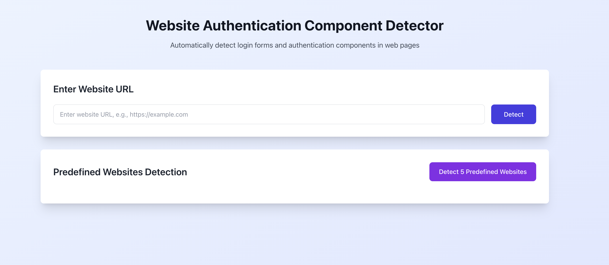
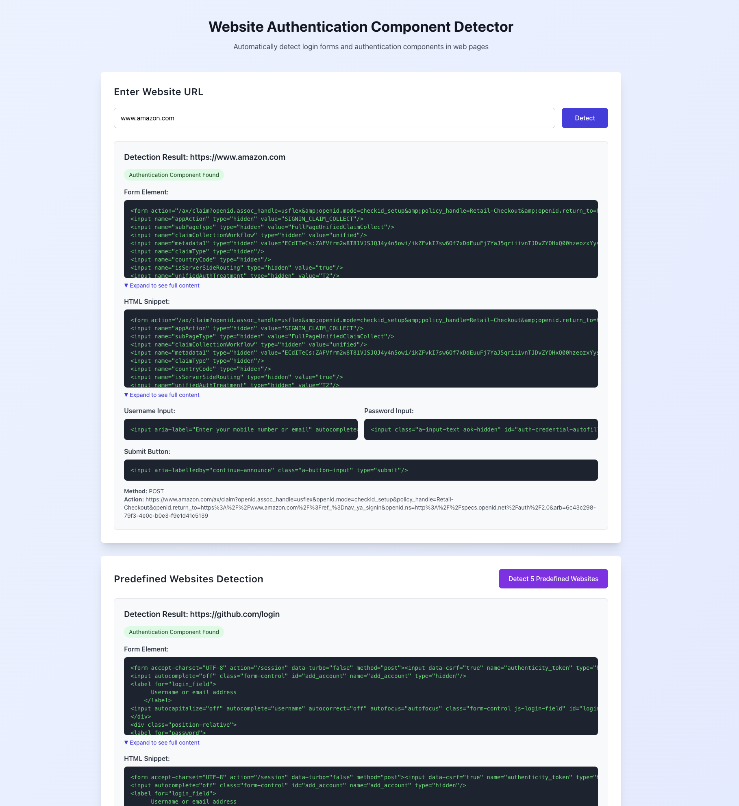

# Website Authentication Component Detector

An AI-powered tool for automatically detecting login forms and authentication components in web pages.

## Screenshots

### Main Interface


### Detection Results


## Features

- ✅ **Web Scraping**: Automatically scrapes website HTML content using static HTTP (fast) or Playwright (for JavaScript-rendered content)
- ✅ **Smart Detection**: Intelligently identifies login forms, username inputs, password inputs, and submit buttons
- ✅ **Auto Navigation**: If homepage URL is provided, automatically finds and clicks login links to navigate to login page
- ✅ **Dynamic URL Input**: Supports inputting any website URL for detection
- ✅ **Batch Detection**: Detects 5 predefined websites simultaneously (GitHub, Stack Overflow, LinkedIn, Quora, Dropbox)
- ✅ **Structured Output**: Returns detailed HTML snippets and form information

## Architecture

- **Backend**: Python FastAPI server (port 8000)
- **Frontend**: React application with Vite (port 5173)

## Tech Stack

### Backend
- FastAPI
- httpx (HTTP client)
- BeautifulSoup4 (HTML parsing)
- Playwright (browser automation for JavaScript-rendered sites)

### Frontend
- React 18
- Vite
- Tailwind CSS
- Axios

## Quick Start

### Prerequisites
- Python 3.8+
- Node.js 18+

### Build & Run

**Option 1: Automated Script (Recommended)**

```bash
# macOS/Linux
./start.sh

# Windows
start.bat
```

**Option 2: Manual Setup**

1. **Backend Setup**:
```bash
cd backend
python -m venv venv
source venv/bin/activate  # Windows: venv\Scripts\activate
pip install -r requirements.txt
python main.py
```

2. **Frontend Setup** (in a new terminal):
```bash
cd frontend
npm install
npm run dev
```

3. **Access the application**:
- Frontend: http://localhost:5173
- Backend API: http://localhost:8000

**Option 3: Docker Deployment (Recommended for Production)**

```bash
# Build and start all services
docker-compose up -d

# View logs
docker-compose logs -f

# Stop services
docker-compose down

# Rebuild after code changes
docker-compose up -d --build
```

Access the application:
- Frontend: http://localhost:5003
- Backend API: http://localhost:9000
- API Documentation: http://localhost:9000/docs

## Usage

1. **Single URL Detection**: Enter any website URL and click "Detect"
2. **Predefined Websites**: Click "Detect 5 Predefined Websites" to test batch detection

## API Endpoints

- `POST /api/scrape` - Detect authentication components for a single URL
- `GET /api/scrape?url=<URL>` - Same as above (GET method)
- `GET /api/predefined` - Detect 5 predefined websites

## How It Works

1. **Static HTTP Method** (primary): Fast scraping using HTTP requests
2. **Playwright Method** (fallback): Used when:
   - Static method fails or detects anti-bot protection
   - URL is a homepage (automatically finds and clicks login links)
   - Site requires JavaScript rendering (e.g., Amazon)

## Project Structure

```
.
├── backend/
│   ├── main.py              # FastAPI application
│   └── requirements.txt     # Python dependencies
├── frontend/
│   ├── src/
│   │   ├── App.tsx         # Main React component
│   │   └── main.tsx         # Entry point
│   └── package.json         # Node.js dependencies
├── start.sh                 # Startup script (macOS/Linux)
├── start.bat                # Startup script (Windows)
└── README.md

```
